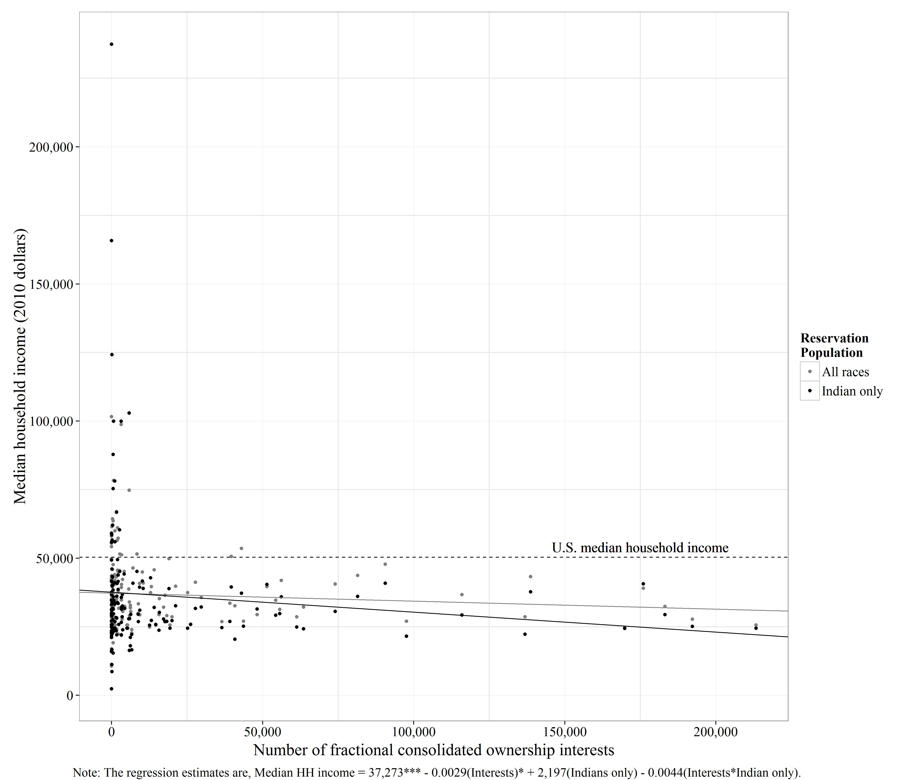
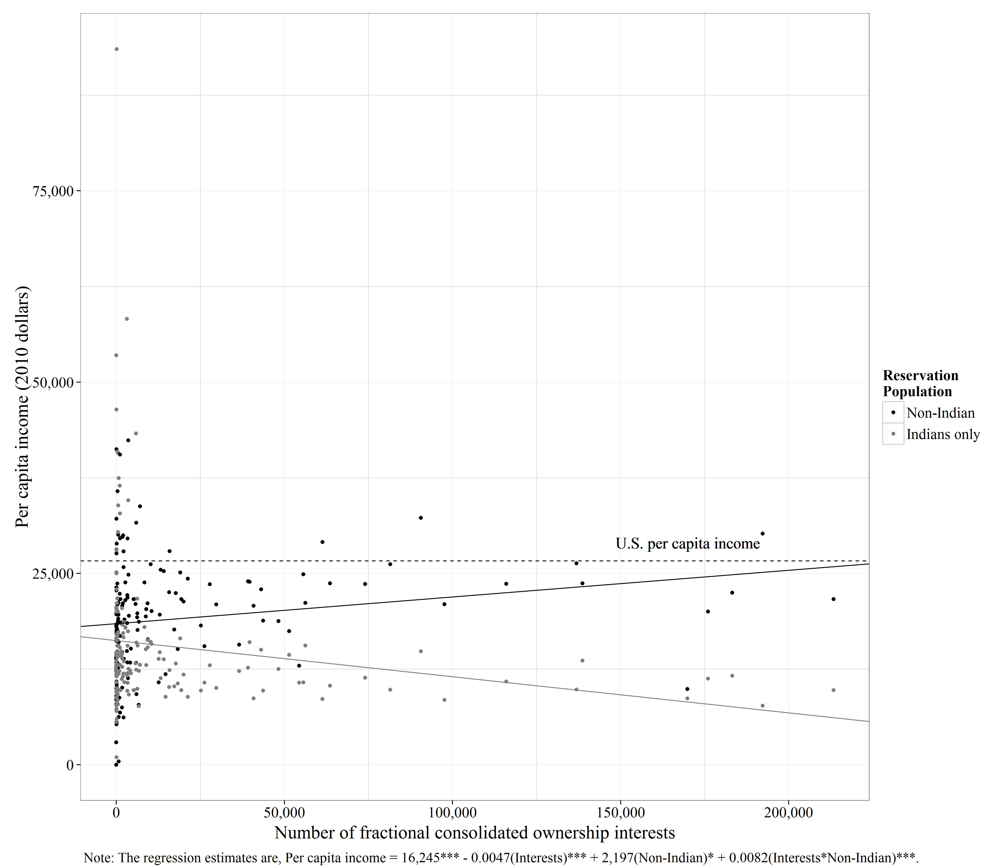
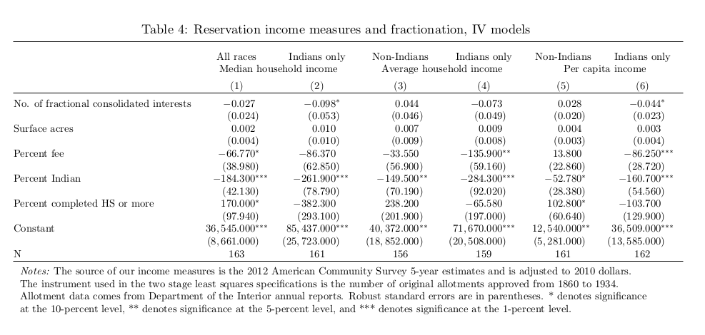
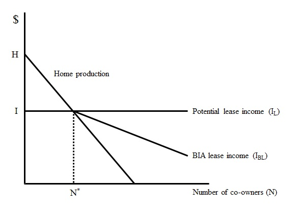
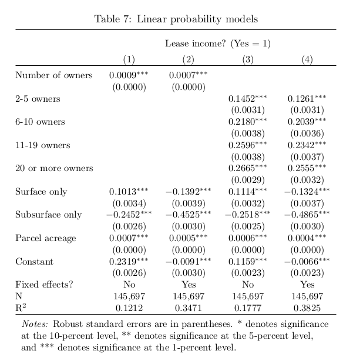
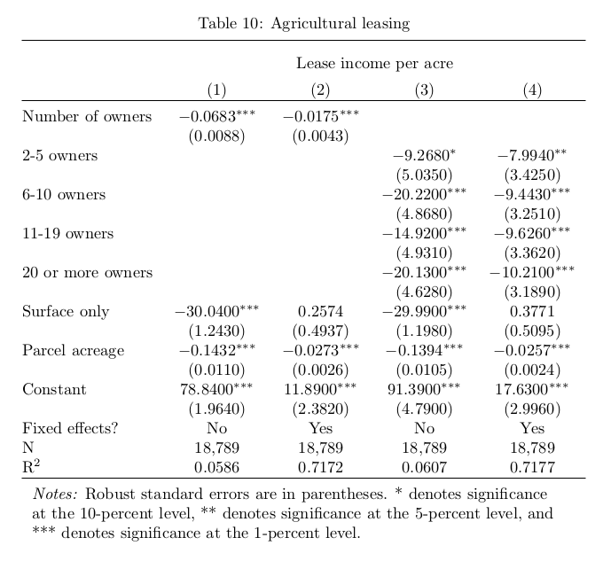

## Introduction

* We study the effect of property rights and institutions for economic 
  growth and development.  

* Application: Estimate the effect of missing property rights on Indian 
  reservations on Indian income.

## Institutions: Land Ownership Rights

* Indians do not control the legal titles to their land parcels
    + Titles to land parcels are held in federal trust with Indians as 
    beneficiaries
    
    + Indian owners cannot unilaterally perform ordinary real estate 
    transactions (sell, mortgage, lease, etc.)  
    
    + It is the Bureau of Indian Affairs (BIA) policy not to approve any 
    Indian land sales, thus no alienation of ownership claims is possible  

## Institutions cont.

* BIA probates the estates of deceased Indians
    + Originally Indian wills were not recognized and wills remain outside the 
      cultural norms of Indians  

* In the absence of a will, heirs typically obtain an equal fraction of 
  the deceased's land interests.
    + Leads to Indian land fractionation

* Land ownership is shared as “tenants in common”
    + Indian co-owners share percentages of the whole parcel, not identifiable 
    (physical) sections of land

## Fractionation Illustrated

\centering

## Data

* Trust Asset and Accounting Management System (TAAMS)
    + Cross-section of all trust land areas (reservations) in April 2010
    + Anonymized system reference number for ownership id
    + Agricultural lease income

* ``Current'' state of the Federal Indian Trust
    + 270,000 Indian owners with 4.6 million Indian ownership records  
    + An average of ~ 17 ownership records per Indian owner

## Hypotheses

* Fractionation increases transaction costs/bargaining costs as to how to use 
  the land

* Implication: Reservations that contain land with higher levels of 
  fractionation will have lower levels of income because of the costs and 
  difficulties of coming to an agreement for how to use the land

## Reservation Level Empirical Model

$$ IndianIncome_{i} = \alpha Fractionation_{i} + \delta X_{i} + \varepsilon _{i}$$
    
* Fractionation is measured as the number of (consolidated) ownership interests 
  on a reservation
* Controls: surface acres, percent fee, percent Indian, percent completed high 
  school

## Reservation: Median Household Income

\centering

## Reservation: Per Capita Income

\centering

## Causal Effect?

* Instrument: Number of allotments approved by BIA (Dept. of Indian Affairs) 
  between 1860 and 1934.
    + More allotments on a reservation means a larger population, thus 
    fractionation is likely to progress faster.   

* IV findings: Same sign and statistical significance as when estimating 
  with OLS

## Reservation IV Models

\centering

## Institutions: Leasing Trust Land 

* For trust property to be ``employed'', BIA requires a lease or permission 
from co-owners  

* Leasing is conditional on BIA approval
    + Majority ownership required to initiate a privately directed lease, 
    a costly activity and BIA approval process is slow

* BIA has responsibility to attempt to lease land which would ``lie fallow'' 
  (when there is no Indian directed lease)

## Principal Agent Issues

- **Principal:** Indians  
- **Agent:** BIA  

* BIA leases tracts and there is anecdotal evidence that BIA does not get 
  maximal possible lease rates
    + Each owner has less of an incentive to monitor that the BIA obtains 
    market rate for leasing, when there are more owners per acre of a given 
    tract.

## Model of ag land leasing

\centering

## Hypotheses

* Less fractionated land is less likely to be leased through BIA  

* When tracts are leased though the BIA, tracts that are more fractionated 
  will generate less lease income

## Estimation Strategy

* Linear probability model

$$ Pr(Lease = 1)_{ij} = \beta_{0} + \beta_{1}Fractionation_{ij} + \delta X_{ij} 
+ \varepsilon _{st} $$

* Fractionation is measured as the number of owners of a given parcel  
* Controls: parcel size and resource type (surface or both surface and 
  subsurface) 

* Agricultural lease income model

$$ LeaseIncomePerAcre_{ij} = \beta_{0} + \beta_{1}Fractionation_{ij} + \delta X_{ij} 
+ \varepsilon _{st} $$      

## Results Linear Probability Models

\centering

## Results Agricultural Income Models

\centering

## Findings

* Fractionation leads to lower Indian incomes on reservations.
    + We suggest that the underlying mechanism is that incomplete 
    property rights increase the transaction costs for Indian 
    landowners.  

* BIA leasing of land is subject to principal agent issues

* We estimate that fractionation reduces the annual agricultural lease 
  income by between $3,962 and $5,062 per parcel per year.  

* Parcels with 20+ owners lease are twice as likely to be leased as 
  those with 2-5 owners. 

---

\begin{center}

\huge{Thank you!}

\end{center}

